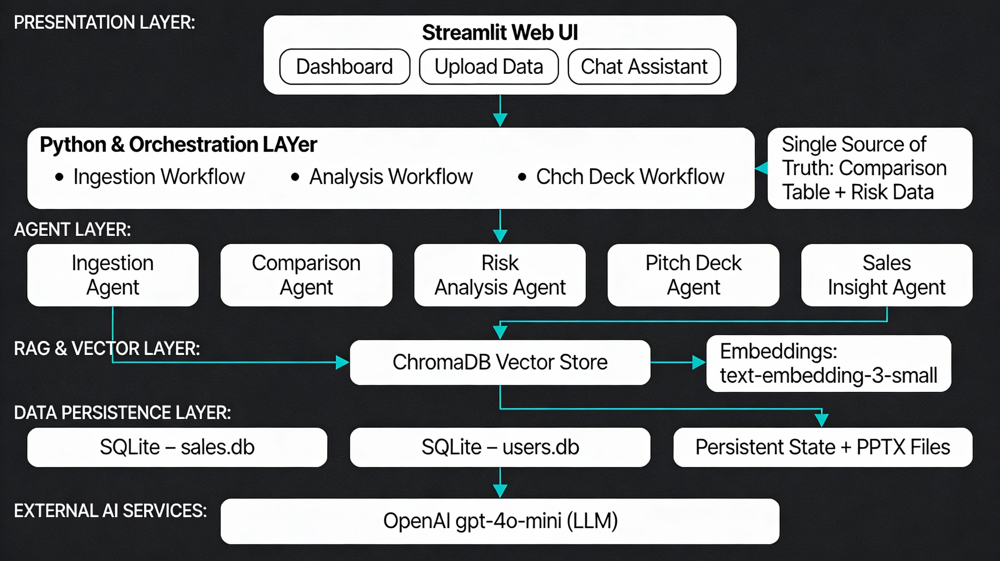
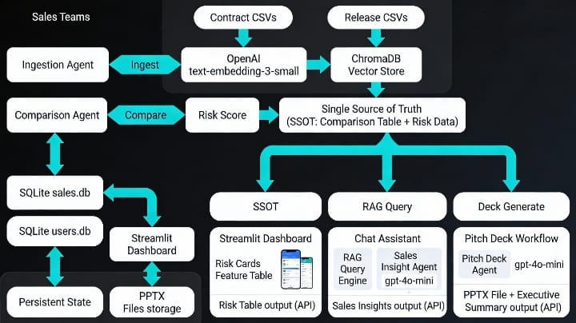

# Sales Enablement AI – AutoGen RAG Dashboard

AI-powered Streamlit application that turns customer contracts and product release data into an interactive risk dashboard, 
executive summaries, and AI-generated sales pitch decks using Retrieval-Augmented Generation (RAG) and AutoGen multi-agent 
architecture.

---

## Overview

Sales teams often struggle to keep customer promises, delivery status, and messaging aligned while products evolve rapidly.
This application ingests customer contracts and product release CSVs, analyzes delivery risk, and provides a focused AI sales
assistant and pitch-deck generator so sales reps can walk into meetings with clear, data-backed stories.
The system is designed as a lightweight, local, single-tenant AI solution, ideal for internal sales enablement, demos, and AI competitions.

---

## Core Features

### Interactive Risk Dashboard
- Clickable HIGH, MEDIUM, LOW, and NONE risk cards
- Instantly filters the feature table for the selected customer
- Drill-down analysis with a reset option

### AI Pitch-Deck Generation
- One-click generation of a structured sales pitch deck
- Uses python-pptx to create a downloadable PPTX file
- Includes speaker notes and a deterministic executive summary

### RAG-Grounded Sales Assistant
- Chat UI for answering questions about delivery risks, feature coverage, and objections
- Powered by ChromaDB and an AutoGen Sales Insight Agent

### Strict Data Model
- Exactly one customer contract CSV
- One or more release CSVs
- SHA-256 file de-duplication
- Persisted state survives Streamlit reruns

### Lightweight Authentication
- Simple username and password login
- Stored locally in SQLite (data/users.db)
- Intended for trusted internal environments only

---
# 🧠 Automated Sales Enablement – System Architecture

This project uses a layered, agent-based architecture to automate sales enablement tasks such as document ingestion, contract comparison, risk analysis, and AI-generated pitch deck creation using Retrieval-Augmented Generation (RAG).

---

## 1. Presentation Layer – Streamlit Web UI

The presentation layer provides an interactive web interface for users.

### Components
- **Dashboard**  
  Displays sales risks, insights, and executive summaries.

- **Upload Data**  
  Allows users to upload customer contracts, product documents, and CSV files.

- **Chat Assistant**  
  Enables conversational querying over uploaded data using AI.

### Technology
- Streamlit (Python)

---

## 2. Python & Orchestration Layer

This layer acts as the control center of the application and manages all workflows.

### Responsibilities
- Orchestrates agent execution
- Manages application state
- Ensures consistent data flow across modules

### Workflows
- **Ingestion Workflow**  
  Processes uploaded documents and prepares them for analysis.

- **Analysis Workflow**  
  Triggers comparison and risk analysis agents.

- **Pitch Deck Workflow**  
  Generates AI-powered PowerPoint pitch decks.

### Single Source of Truth
- Central comparison table and risk data used across dashboard, chat, and pitch deck generation.

---

## 3. Agent Layer (Multi-Agent System)

The system follows a modular multi-agent design where each agent has a specific responsibility.

### Agents
- **Ingestion Agent**  
  Parses and chunks uploaded documents.

- **Comparison Agent**  
  Compares customer commitments against product capabilities.

- **Risk Analysis Agent**  
  Identifies delivery, scope, and expectation risks using AI reasoning.

- **Pitch Deck Agent**  
  Converts insights into structured PPTX pitch decks.

- **Sales Insight Agent**  
  Generates executive summaries and sales-ready insights.

---

## 4. RAG & Vector Layer

This layer enables semantic search and context-aware AI responses.

### Components
- **ChromaDB Vector Store**  
  Stores vector embeddings of documents.

- **Embedding Model**  
  `text-embedding-3-small`

### Purpose
- Enables Retrieval-Augmented Generation (RAG)
- Grounds AI responses in actual customer and product data

---

## 5. Data Persistence Layer

This layer handles long-term data storage and application state.

### Storage
- **SQLite – sales.db**  
  Stores sales data and analysis results.

- **SQLite – users.db**  
  Stores user sessions and metadata.

- **Persistent State & PPTX Files**  
  Stores generated pitch decks and application state.

---

## 6. External AI Services

This layer provides AI reasoning and natural language generation.

### Model Used
- **OpenAI GPT-4o-mini**

### Capabilities
- Risk reasoning
- Executive summaries
- Chat assistant responses
- Pitch deck content generation

---

## End-to-End Flow

1. User uploads data via the Streamlit UI  
2. Ingestion Agent processes and embeds documents  
3. Data is stored in ChromaDB  
4. Agents retrieve context using RAG  
5. Risk analysis and insights are generated  
6. Results are displayed on the dashboard, chat assistant, or exported as PPTX

---

## Architecture Benefits

- Modular multi-agent design  
- RAG-powered accurate AI responses  
- Single source of truth for sales insights  
- Easily extensible and scalable  
- Suitable for competition-level AI solutions

---

## Key Flows

### Upload Flow
1. Upload one contract CSV with columns:
   - customer_name, feature_id, feature_name, description, priority
2. Upload one or more release CSVs with columns:
   - customer_name, feature_id, feature_name, status
3. Data is stored in SQLite, normalized, chunked, embedded, and ingested into ChromaDB

### Analysis Flow (Dashboard and Chat)
- Contract and release data is loaded per selected customer
- compare_features_agent builds the feature comparison table
- risk_analysis_agent produces risk counts and a summary table
- The same computed data is shared by the dashboard and chat

### Pitch-Deck Flow
- generate_pitch_deck_content_sync creates structured slide content
- build_pptx_from_content generates a downloadable PPTX file
- build_executive_summary computes delivery percentage and risk counts deterministically

---

## Tech Stack

- Language: Python 3.x
- UI Framework: Streamlit
- Agents: AutoGen
- LLM: OpenAI gpt-4o-mini
- Embeddings: text-embedding-3-small
- Vector Database: ChromaDB
- Databases: SQLite
- State Management: Pickle
- Deck Generation: python-pptx

---

## Repository Structure

```bash
.
├── app.py
├── db/
│   └── db_utils.py
├── rag/
│   └── rag_engine.py
├── logic/
│   ├── comparator.py
│   ├── risk_engine.py
│   ├── sales_insight.py
│   ├── sales_context.py
│   └── pitch_deck.py
├── utils/
│   └── utils.py
├── data/
│   ├── sales.db
│   ├── users.db
│   ├── chroma/
│   └── persistent_state.pkl
├── .env.example
└── requirements.txt

## Architecture Diagram


## Workflow diagram


## Getting Started
Prerequisites

Python 3.10 or higher
Virtual environment tool (venv or conda)
OpenAI API key with access to gpt-4o-mini and text-embedding-3-small

## Installation
git clone <this-repo-url>
cd <repo-folder>

python -m venv venv
source venv/bin/activate       # Windows: venv\Scripts\activate

pip install -r requirements.txt
cp .env.example .env
Set your OPENAI_API_KEY in the .env file.

## Run the Application
streamlit run app.py

Open http://localhost:8501 in your browser


## Using the Application

Login or Signup using the built-in authentication
Upload one contract CSV and one or more release CSVs
Explore risks in the dashboard using risk cards
Generate an AI-powered sales pitch deck and executive summary
Ask delivery and risk questions using the sales assistant chat

## Limitations

Local, single-tenant design
Not suitable for public or internet-facing deployment
Simple authentication without production-grade security

## License

This project is released under the MIT License.